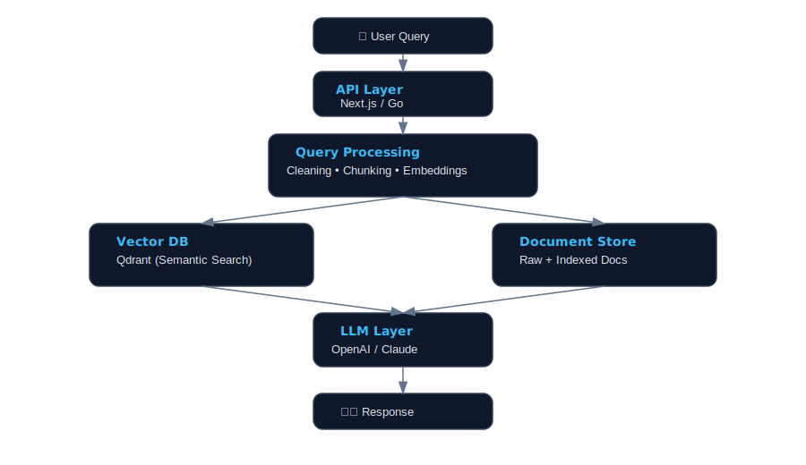
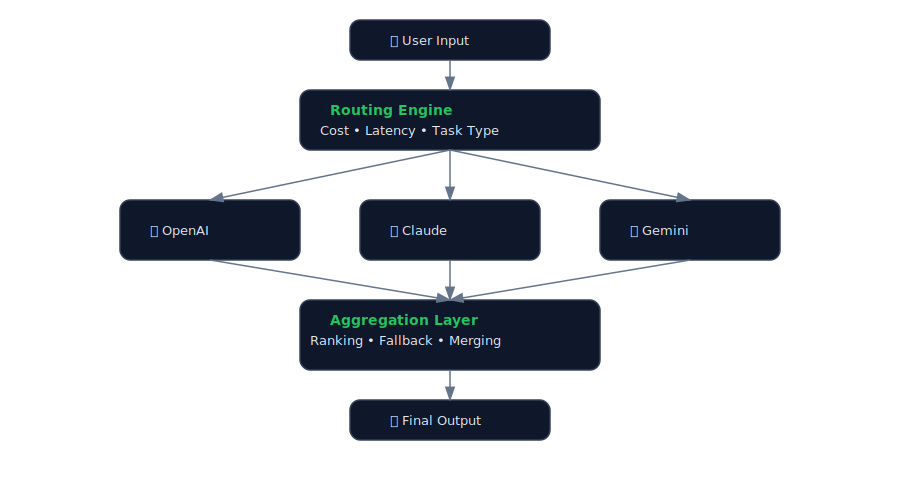
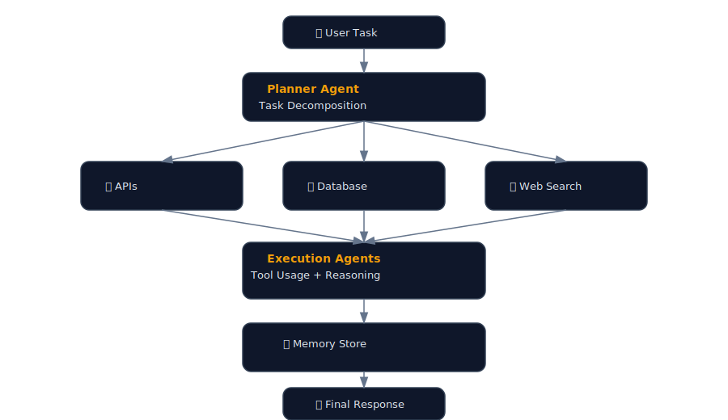

<h1 align="center">Muhammad Ibrahim</h1>
<h3 align="center">Full-Stack AI Engineer | RAG Systems | LLM Orchestration | Production AI</h3>

Designing and building <b>production-grade AI systems</b> using LLMs, RAG pipelines, and agentic workflows.

---

## 🚀 About Me

* 🧠 AI Engineer specializing in **LLM-powered systems & RAG architectures**
* ⚙️ Backend-focused with **Go for performance-critical services**
* 🌐 Full-stack capable using **Next.js, React, TypeScript**
* 🤖 Daily development with **Claude Code, Codex, Copilot**
* 🏗️ Focused on **real-world systems**, not demos

---

## 🧠 Core Capabilities

### 🔹 Retrieval-Augmented Generation (RAG)

* Multi-modal ingestion: `.pdf`, `.docx`, `.xlsx`, `.ppt`, `.txt`
* Vector search using **Qdrant**
* Hybrid retrieval (semantic + keyword)
* Context optimization & chunking strategies

### 🔹 LLM Systems

* Multi-model orchestration (**OpenAI, Claude, Gemini, Llama**)
* Prompt engineering with structured outputs
* Routing, fallback, and cost optimization strategies

### 🔹 Agentic Workflows

* Microsoft AutoGen
* LangChain / LangSmith
* Tool-augmented reasoning systems

### 🔹 Backend & Architecture

* Clean architecture / DDD-inspired design
* High-performance APIs in **Go**
* Scalable system design & modular services

---

## 🛠️ Tech Stack

### Languages & Frameworks

### AI / LLM / RAG

* LangChain, LangSmith, AutoGen, MCP
* OpenAI, Claude, Gemini, Llama, HuggingFace
* Qdrant (Vector Database)

### Infra & Databases

---

### 🔹 AI Website Builder

* Generate full-stack websites via natural language
* Live preview + one-click deployment
* LLM-driven UI + backend generation
* PostgreSQL-backed persistence

---

### 🔹 AI Humanizer (Production)

* Multi-mode transformations (Formal, Casual, Enhanced)
* Optimized outputs to bypass AI detection systems
* Built on **Azure AI Foundry**

---

# 🧩 System Architecture (RAG Pipeline)

**Highlights:**
- Hybrid retrieval with vector + document store
---

# 🧠 Multi-Model Orchestration Architecture

**Highlights:**
- Model routing based on latency & cost
---

# 🤖 Agent Workflow Architecture

**Highlights:**
- Agent-based execution with tool integration
---

## 📊 GitHub Stats

---

## 📫 Connect

* LinkedIn: https://linkedin.com/in/m-ibrahim-pro
* Email: [m.ibrahm.0001@gmail.com](mailto:m.ibrahm.0001@gmail.com)

---

## ⚡ Engineering Philosophy

> “AI systems are not prompts — they are architectures.”

I build systems that are:

* Scalable
* Observable
* Maintainable
* Production-ready

---

## 📌 Current Focus

* Advanced RAG systems (hybrid retrieval, re-ranking)
* Agent-based architectures with tool usage
* High-performance AI backends in Go
* Multi-model LLM orchestration systems
